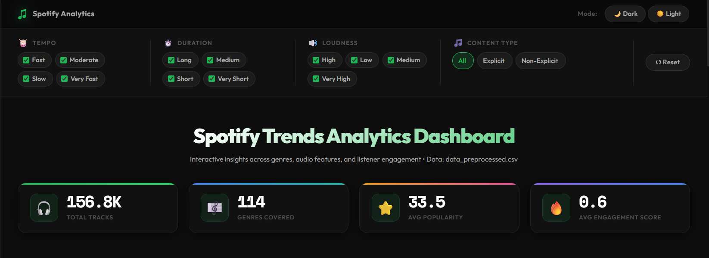
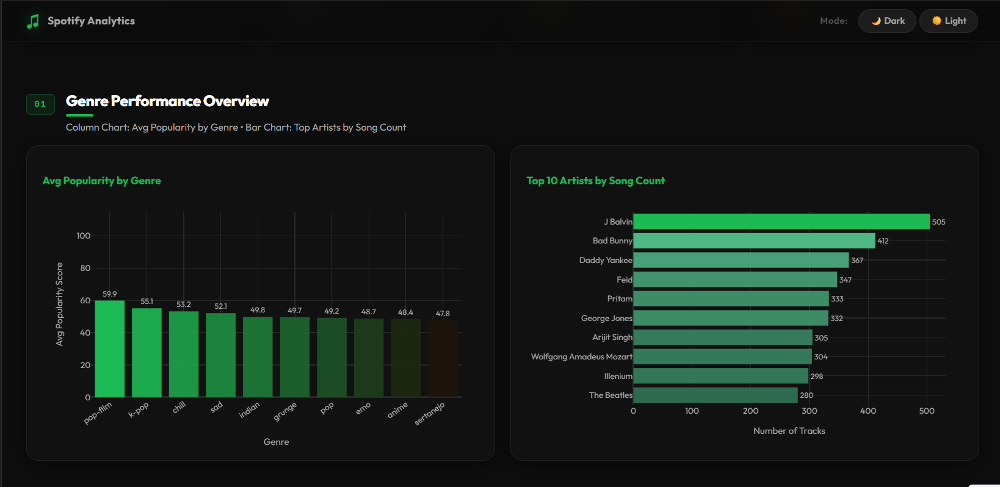
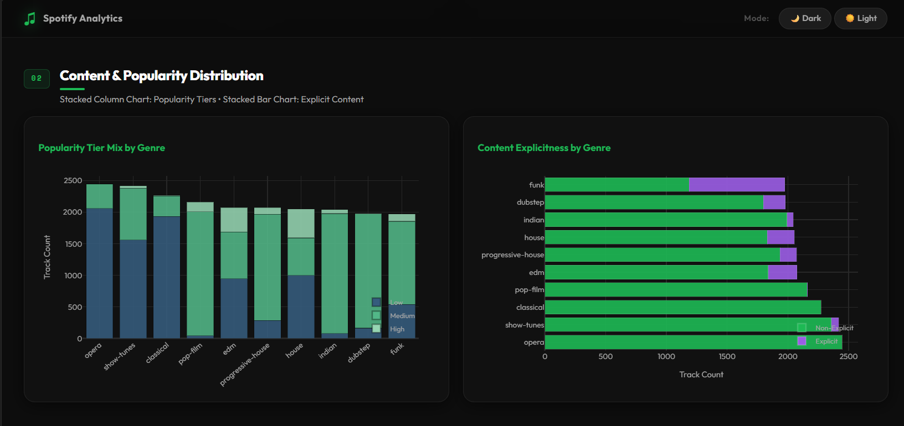
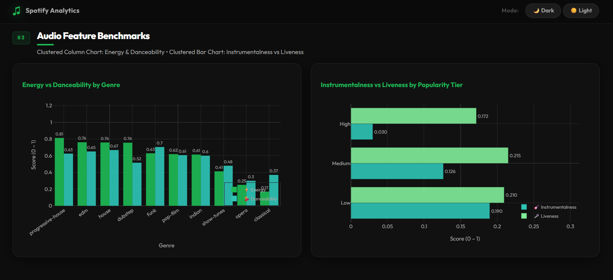
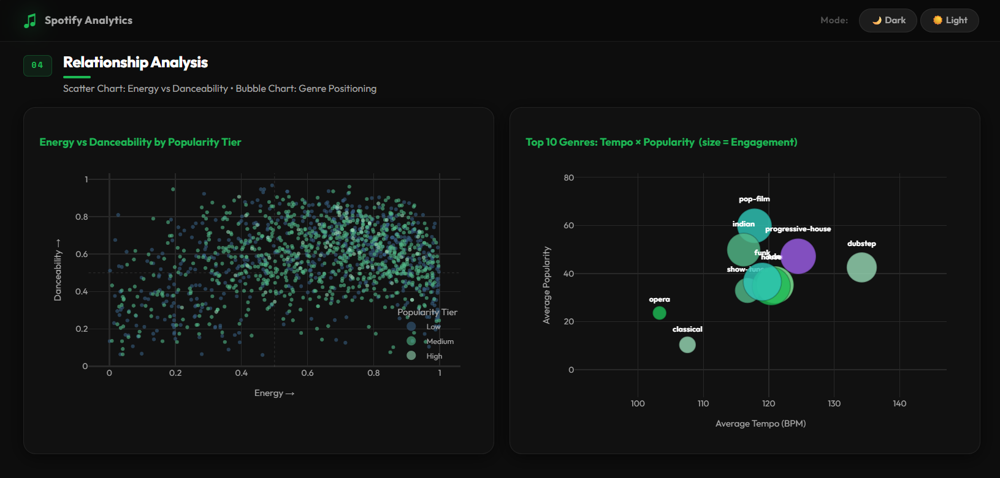
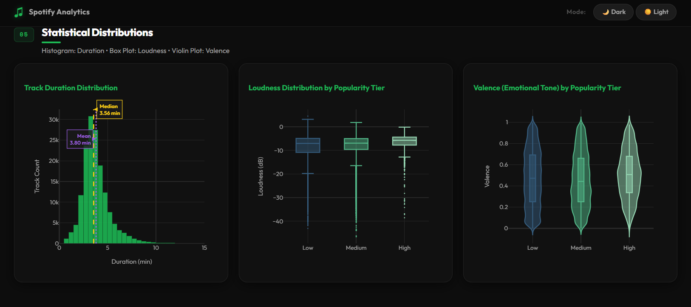
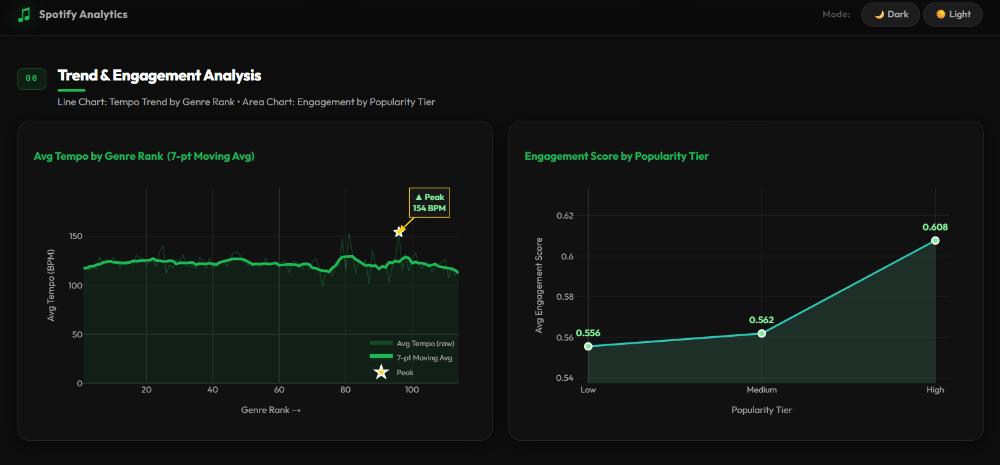

# Spotify Music Trends Dashboard


## Overview

Spotify Music Trends Dashboard is a polished interactive analytics web app built with Python Dash and Plotly. It uses a preprocessed Spotify track dataset to visualize genre performance, audio feature behavior, popularity tiers, and listener engagement with modern dark/light styling.

This repository contains:

- A complete Dash application entrypoint in `app.py`
- Custom dashboard CSS in `assets/style.css`
- Dataset files in `data/`
- A preprocessing notebook for data preparation in `notebooks/preprocessing.ipynb`

## What it does

The dashboard delivers exploratory insights for Spotify tracks via:

- KPI cards for total tracks, genres, average popularity, and engagement score
- Genre-level popularity and content breakdowns
- Audio feature benchmarking for energy, danceability, instrumentalness, and liveness
- Relationship visualizations using scatter and bubble charts
- Distribution views for duration, loudness, and valence
- Trend analysis for tempo and engagement across popularity tiers
- Filter controls for Tempo, Duration, Loudness, and Explicit/Non-Explicit content
- Theme toggle for dark/light presentation

## Technologies & Skills

- Python
- Dash
- Plotly Express / Plotly Graph Objects
- Pandas
- NumPy
- HTML/CSS custom dashboard styling
- Jupyter Notebook for preprocessing

## Project Structure

```text
Spotify-music-trends-dashboard/
├── app.py
├── README.md
├── .gitignore
├── assets/
│   └── style.css
├── data/
│   ├── raw_data.csv
│   └── data_preprocessed.csv
├── notebooks/
│   └── preprocessing.ipynb
└── Screenshots/
    ├── Header.png
    ├── 1.png
    ├── 2.png
    ├── 3.png
    ├── 4.png
    ├── 5.png
    └── 6.png
```

## Important Files

- `app.py` - main Dash application with layout, filters, callbacks, and charts
- `assets/style.css` - custom styling for the dashboard, including dark/light theme tokens and responsive UI
- `data/data_preprocessed.csv` - cleaned dataset required by the app at runtime
- `data/raw_data.csv` - original Spotify data source for preprocessing
- `notebooks/preprocessing.ipynb` - data cleaning and feature engineering pipeline used to create the preprocessed dataset

## Installation

1. Create a Python environment (recommended):

```bash
python -m venv venv
venv\Scripts\activate
```

2. Install required packages:

```bash
pip install dash pandas plotly numpy
```

3. Verify that `data/data_preprocessed.csv` exists.

> `app.py` exits if the required preprocessed CSV file is missing.

## Run the Dashboard

From the project root:

```bash
python app.py
```

Then open your browser at:

```text
http://127.0.0.1:8050
```

## Usage

- Use the four filter panels to constrain the dataset by tempo category, duration category, loudness category, and explicit content type.
- Click **Reset** to restore all filters to the default full dataset.
- Toggle between **Dark** and **Light** themes using the top bar controls.
- Explore each chart area to compare genres, artists, and Spotify audio metrics.


## Dashboard Screenshots

### Main Dashboard Header


### Genre Performance & Popularity


### Content & Popularity Distribution


### Audio Feature Benchmarks


### Relationship Analysis


### Statistical Distributions


### Trend & Engagement Analysis


## Notes

The app uses a hardcoded `TOP_N = 10` for genre and artist ranking charts. The dataset is expected to include audio features such as `danceability`, `energy`, `tempo`, `valence`, and `explicit_label`, plus computed fields like `engagement_score` and `popularity_level`.

